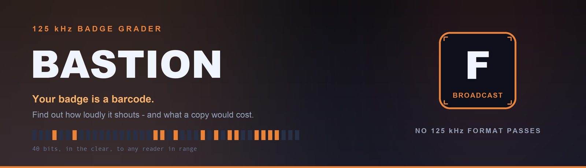
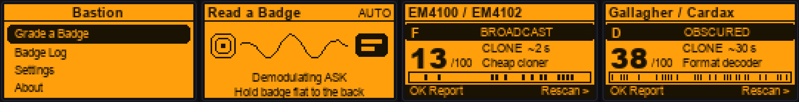
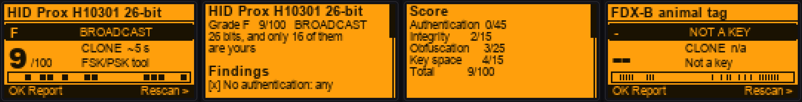
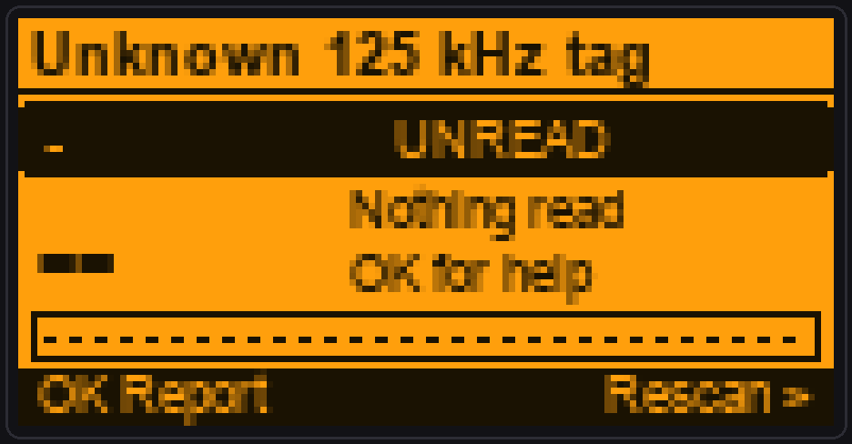
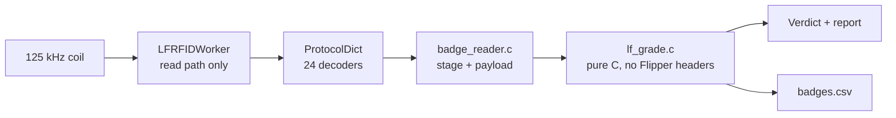

<div align="center">



# Bastion

**Your badge is a barcode. Find out how loudly it shouts.**

Hold a 125 kHz badge to the back of your Flipper. Bastion identifies the format, works out how an attacker would treat it, and hands back a plain-English security grade — with a full report on what is plaintext, what is left to guess, and what a copy would cost.

[](https://flipperzero.one/)
[](https://github.com/at0m-b0mb/Bastion-FlipperZero/actions)
[](#)
[-2EDC82?style=flat-square)](#)
[](#the-grade-table)
[](LICENSE)
[](https://github.com/at0m-b0mb)

</div>

---

## The idea

Almost every building still runs on 125 kHz. The white card in your wallet, the fob on your keyring, the badge that opens the server room — most of them are **EM4100** or **HID Prox**, technology from the 1990s that has no cryptography at all. They work by reciting a fixed number to anything that powers them up.

Most people have no idea. A card that opens a datacentre looks and taps exactly like a card that opens a gym locker.

Bastion closes that gap: one tap, one grade, in words a human understands.

> **Read-only, always.** Bastion uses the firmware's read path and nothing else. It never writes a blank, never emulates your badge, never leaves a trace on the tag. It tells you exactly what any reader already learns when you walk past it.

<div align="center">

<br>
<sub><b>Menu → Read → Verdict.</b> An EM4100 (F, BROADCAST) and a Gallagher Cardax (D, OBSCURED). The bar strip along the bottom is the credential's own bits.</sub>
</div>

---

## Everything here is an F. That is the finding.

**No 125 kHz credential the Flipper can read has authentication.** Not one. Every format in the table below answers any reader in range with the same fixed number, forever — no challenge, no session, no secret. A recording is a working copy.

So Bastion's scale gives **45 of its 100 points to authentication**, and nothing at this frequency can win a single one of them. The ceiling is 55, the best real format scores 38, and the letter grade is F almost everywhere.

That is not a broken scale. It is the point. What still varies — and what you actually compare badges by — is the **score**, the **band**, and **what a copy costs**.

The letter thresholds are the same ones [Warden](https://github.com/at0m-b0mb/Warden-FlipperZero) uses at 13.56 MHz, deliberately: an F here and an F there mean the same thing, so you can grade a mixed site with both and compare the results directly.

---

## How Bastion grades

Four terms, all published on the device so you can check the arithmetic yourself:

| Term | Max | Question |
|---|:---:|---|
| **Authentication** | 45 | Does the credential prove it is itself? *(0 for every LF format — this is the story)* |
| **Integrity** | 15 | Can a corrupted or invented ID be spotted? Capped low: the attacker computes the checksum too. |
| **Obfuscation** | 25 | Does the payload need a decoder that knows the format? The only term that meaningfully separates these. |
| **Key space** | 15 | Once one badge from the site is read, how much is left to guess for the next one? |

The **band** describes the credential's exposure; the **copy cost** describes what the attacker needs to own. They are different axes, which is why a format can be `CLONEABLE` yet still demand a format-aware tool.

```
BROADCAST   0–14   Plaintext fixed ID. It shouts a number; anything listening repeats it.
CLONEABLE  15–27   Structured, still plaintext. A decoder turns it back into a working copy.
OBSCURED   28+     Proprietary encoding. Prices out a casual attacker, not a prepared one.
NOT A KEY    —     An animal transponder. Never designed to secure anything.
```

### The grade table

Every format the firmware can decode, graded. Generated from the engine itself — the same code that runs on the device.

| Format | Family | Grade | Score | Band | Copy cost |
|---|---|:---:|:---:|:---:|---|
| **Gallagher / Cardax** | Gallagher | **D** | 38 | 🟡 OBSCURED | ~30 s, a format-aware tool |
| **Nexwatch / Nedap** | Nedap | **D** | 35 | 🟡 OBSCURED | ~30 s, a format-aware tool |
| **G-Prox-II** | Guardall / Verex | **F** | 28 | 🟡 OBSCURED | ~30 s, a format-aware tool |
| **Keri** | Keri Systems | **F** | 23 | 🟠 CLONEABLE | ~30 s, a format-aware tool |
| **Jablotron** | Jablotron | **F** | 20 | 🟠 CLONEABLE | ~2 s, any handheld cloner |
| **Paradox** | Paradox | **F** | 20 | 🟠 CLONEABLE | ~5 s, any FSK/PSK reader |
| **Viking** | Viking | **F** | 19 | 🟠 CLONEABLE | ~2 s, any handheld cloner |
| **Indala 26-bit** | Indala / Motorola | **F** | 18 | 🟠 CLONEABLE | ~5 s, any FSK/PSK reader |
| **Noralsy** | Noralsy | **F** | 18 | 🟠 CLONEABLE | ~2 s, any handheld cloner |
| **PAC / Stanley** | PAC (Stanley) | **F** | 16 | 🟠 CLONEABLE | ~2 s, any handheld cloner |
| **Idteck** | Idteck | **F** | 16 | 🟠 CLONEABLE | ~2 s, any handheld cloner |
| **ioProx XSF** | Kantech | **F** | 15 | 🟠 CLONEABLE | ~5 s, any FSK/PSK reader |
| **HID Prox (extended)** | HID Prox | **F** | 14 | 🔴 BROADCAST | ~5 s, any FSK/PSK reader |
| **Electra** | EM Microelectronic | **F** | 14 | 🔴 BROADCAST | ~2 s, any handheld cloner |
| **HID Prox (generic)** | HID Prox | **F** | 13 | 🔴 BROADCAST | ~5 s, any FSK/PSK reader |
| **EM4100 / EM4102** | EM Microelectronic | **F** | 13 | 🔴 BROADCAST | ~2 s, any handheld cloner |
| **Securakey** | Securakey | **F** | 13 | 🔴 BROADCAST | ~2 s, any handheld cloner |
| **Farpointe Pyramid** | Farpointe Data | **F** | 13 | 🔴 BROADCAST | ~5 s, any FSK/PSK reader |
| **EM4100 (32-bit)** | EM Microelectronic | **F** | 13 | 🔴 BROADCAST | ~2 s, any handheld cloner |
| **AWID 26-bit** | AWID | **F** | 12 | 🔴 BROADCAST | ~5 s, any FSK/PSK reader |
| **HID Prox H10301 26-bit** | HID Prox | **F** | 9 | 🔴 BROADCAST | ~5 s, any FSK/PSK reader |
| **EM4100 (16-bit)** | EM Microelectronic | **F** | 8 | 🔴 BROADCAST | ~2 s, any handheld cloner |
| **FDX-B animal tag** | ISO 11784/11785 | **–** | – | ⚫ NOT A KEY | not an access credential |
| **FDX-A animal tag** | FECAVA | **–** | – | ⚫ NOT A KEY | not an access credential |

**Bottom of the table:** *HID H10301 26-bit* — the most deployed access credential in the world. Eight bits of facility code, shared by every badge your site ever issued, and sixteen bits of card number. Read one badge and the site half of all the others comes with it.

**Top of the table:** *Gallagher Cardax* — genuinely the best-engineered format at this frequency. Region, facility, card number and issue level run through a proprietary obfuscation, and a lost card can be invalidated without reissuing its number. It is still a fixed transform with no secret in the reader, and the frame never changes.

**Animal tags are not graded.** FDX-A and FDX-B are pet and livestock chips. Scoring them against door-security criteria would be meaningless, so Bastion refuses and says why. If one of them opens a door, *that* is the finding.

---

## What you get

<div align="center">

<br>
<sub><b>Press OK on any verdict for the full report.</b> Findings, the score arithmetic, the decoded fields, and a plain-English verdict.</sub>
</div>

The report covers:

- **Findings** — critical breaks, real weaknesses, genuine strengths and neutral facts, each tagged `[x] [!] [+] [i]`. Written against *your* badge: an H10301 report names your actual facility code and points out that it is on every other badge in the building.
- **The score, itemised** — all four terms and the total, because a grade nobody can check is just an opinion.
- **This badge** — the format, vendor, family, decoded ID, how many bits it carries, how many are left to guess on-site, how many agreeing reads confirmed it, and the raw bytes.
- **Decoded fields** — the firmware decoder's own breakdown: facility codes, card numbers, issue levels, whatever this format carries.
- **Cost to copy** — how long, and what the attacker needs to own.
- **Verdict** — a paragraph on what this format is, where it came from, and what it means for you.

### Badge log

Auditing a site means walking it with a pocketful of credentials, and nobody remembers the sixth one. Every graded badge is appended to a CSV on the SD card:

```
/ext/apps_data/bastion/badges.csv
```

`Badge Log` shows the newest twenty on the device; the file itself opens in a spreadsheet for the write-up. Clear it from Settings, or turn logging off entirely.

### Settings

| Setting | Default | Why |
|---|:---:|---|
| **Read mode** | AUTO | Alternates the ASK and PSK demodulators. Pin one to help a marginal read on a tag whose carrier you already know. |
| **Log badges** | ON | Append every verdict to the CSV. |
| **Sound / Vibro / LED** | ON | Three distinct signals, so the verdict lands before you look at the screen. |
| **Clear log** | — | Deletes the CSV and confirms in place. |

---

## Install

**From a release (easiest)**

1. Download `bastion.fap` from the [latest release](https://github.com/at0m-b0mb/Bastion-FlipperZero/releases/latest).
2. Copy it to your SD card under `apps/RFID/`.
3. On the Flipper: `Apps → RFID → Bastion`.

**With qFlipper** — drag `bastion.fap` into `SD Card/apps/RFID/`.

**Build it yourself**

```bash
python3 -m pip install --upgrade ufbt
git clone https://github.com/at0m-b0mb/Bastion-FlipperZero.git
cd Bastion-FlipperZero
ufbt
```

The `.fap` lands in `dist/`. `ufbt launch` builds, uploads and starts it on a connected Flipper.

---

## How to use it

1. `Grade a Badge`.
2. Hold the badge **flat against the back** of the Flipper, centred. 125 kHz coupling is tight — no metal, no phone, no other cards in between.
3. Watch the read stage: *Sensing → Tag in field → Demodulating ASK/PSK → Decoded*.
4. Read the verdict. Press **OK** for the full report, **→** to grade another.

If nothing decodes within twenty seconds, Bastion stops guessing and says so — a grader that sits on *Sensing…* forever leaves you wondering whether the badge is wrong, the placement is wrong, or the app is broken. The report then carries the troubleshooting:

<div align="center">

</div>

Common causes: the badge is **13.56 MHz**, not 125 kHz — grade that with [Warden](https://github.com/at0m-b0mb/Warden-FlipperZero) instead. Or the format sits outside the firmware's decoder set. Or the coupling is poor: try forcing ASK or PSK in Settings, and take the badge out of a wallet holding other cards.

---

## Under the hood



The grading engine (`helpers/lf_grade.c`) deliberately includes no Flipper header. That keeps it compilable for the host, which is what makes it testable — and the grade is the entire product, so it gets tested on every push rather than eyeballed on a screenshot:

```bash
make -C test
```

669 checks, built against the real engine — every format's score, letter, band and copy cost pinned; both sides of every band boundary; the animal-tag and unread paths; decoded-payload parsing; buffer and clamping behaviour, under ASan and UBSan. A threshold edit that changes a verdict fails CI.

The reader (`helpers/badge_reader.c`) wraps the firmware's `LFRFIDWorker`. Its callback runs on the worker thread and does nothing but record a stage under a mutex; every dictionary read happens on the GUI thread, after the worker is stopped, so nothing reads the decoders' buffers while they are still being written.

`tools_gen_mockups.py` renders the README's screenshots from the **same layout constants** as the C. Drawing the screens the way the firmware does is what catches a collision before it ships.

```
bastion.c              app shell, notification sequences
helpers/lf_grade.*     the grading engine — pure C, host-tested
helpers/badge_reader.* LFRFIDWorker wrapper, read-only
helpers/bst_store.*    settings + the badge CSV
views/scan_view.c      coil → carrier → badge animation
views/result_view.c    the verdict card + the bit strip
scenes/                start · scan · result · report · log · settings · about
test/                  host tests for the engine
```

---

## What Bastion will not do

It has no write path, no emulation path and no clone function, and it never will. Those exist in the stock **125 kHz RFID** app for people who need them; Bastion's entire value is that it is the thing you can hand to someone and say *"this only looks."*

It does not crack anything either — there is nothing at 125 kHz to crack. Every number in the report is one the tag volunteers to any reader that powers it up.

**Grade badges you own or are authorised to test.** Know your own doors before someone else does.

---

## The uncomfortable follow-up

If your site graded badly, the fix is not a better 125 kHz card. There isn't one. The only LF technology with real cryptography is **Hitag2**, and its cipher is broken too.

The fix is 13.56 MHz with mutual authentication: **DESFire EV2/EV3**, **Seos**, or **iCLASS SE**. Grade those with **[Warden](https://github.com/at0m-b0mb/Warden-FlipperZero)**, Bastion's sibling — same scale, same letters, other radio.

---

## Related

| Project | What it does |
|---|---|
| **[Warden](https://github.com/at0m-b0mb/Warden-FlipperZero)** | The 13.56 MHz grader. Mifare Classic, DESFire, Ultralight, FeliCa, EMV. |
| **[RollCall](https://github.com/at0m-b0mb/RollCall-FlipperZero)** | Grades Sub-GHz rolling-code fobs and proves the code advances. |
| **[Faraday](https://github.com/at0m-b0mb/Faraday-FlipperZero)** | Grades how much a signal-blocking pouch actually blocks. |

---

<div align="center">

**MIT** · built by **[at0m-b0mb](https://github.com/at0m-b0mb)**

<sub>Bastion reads. It never writes.</sub>

</div>
